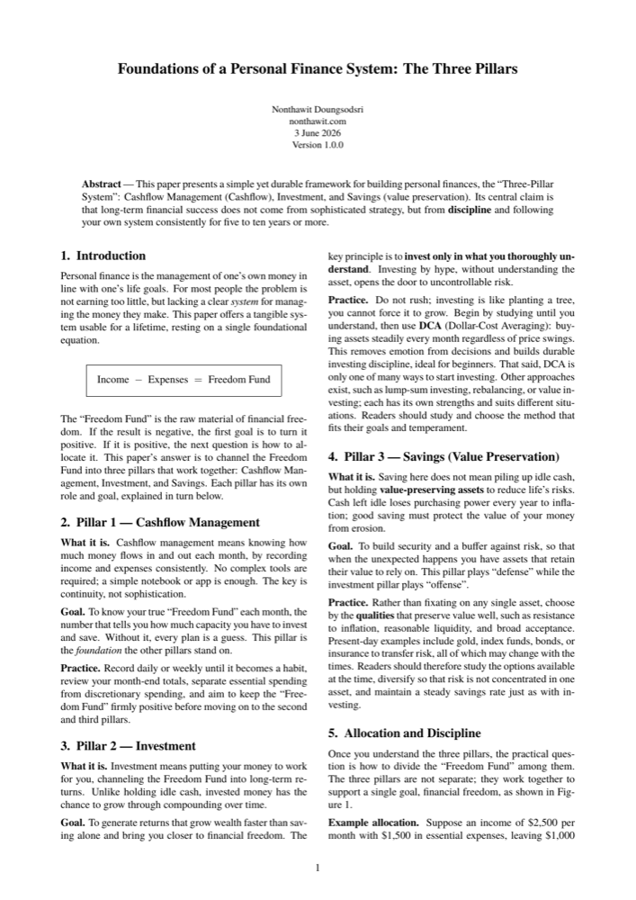
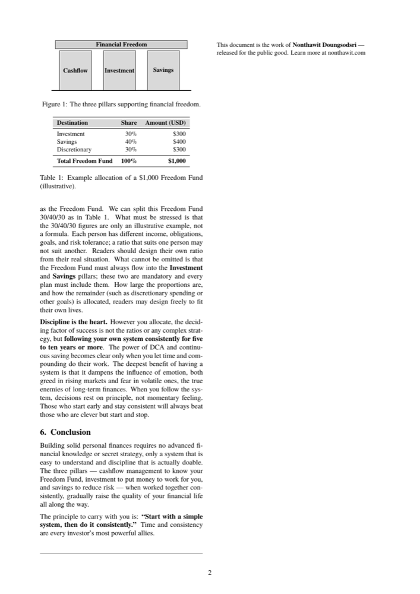

<div align="center">

🌐 **Language** &nbsp;|&nbsp;
[🇹🇭 ไทย](readme/README-th.md) ·
**[🇬🇧 English](README.md)** ·
[🇪🇸 Español](readme/README-es.md) ·
[🇮🇩 Indonesia](readme/README-id.md) ·
[🇨🇳 简体中文](readme/README-zh.md) ·
[🇯🇵 日本語](readme/README-ja.md)

<br>

# Foundations of a Personal Finance System: The Three Pillars

**A concise whitepaper that shows you how to build a personal finance system using the "Three-Pillar" framework — simple, and built to last a lifetime.**

[](LICENSE)


</div>

---

## ⭐ 10-Second Summary

Lasting financial stability does not come from complex strategy — it comes from **discipline** and a simple, repeatable system. Everything begins with a single equation:

<div align="center">

### Income − Expenses = Freedom Fund

</div>

Then allocate that "Freedom Fund" across **3 pillars** that work together:

| Pillar | What it is | Role |
|---|---|---|
| 💵 **Cashflow** | Know how much money flows in and out | Foundation — reveals your true "Freedom Fund" |
| 📈 **Investment** | Put your money to work for you | Offense — builds compounding returns over time |
| 🛡️ **Savings** (Value Preservation) | Hold assets that preserve value | Defense — beats inflation, reduces risk |

---

## 🎯 Why This Document Exists

- It is a **founding principle** that lets you design your own financial system
- It gives readers a **financial mindset built for life** — not a technique that goes stale with the times
- Concise: 2 pages, one read-through, immediately actionable

## 👤 Who It Is For

- Anyone **starting from zero** who wants a financial system at last
- Anyone who can never seem to save, unsure where the money disappears to
- Anyone who wants to pass on a sound financial philosophy to the people they care about

---

## ✨ What Installing This Does to Your AI

With the skill installed, your AI stops giving generic money tips and reasons through the Three-Pillar System:

- Anchors every answer on your real numbers — `Income − Expenses = Freedom Fund` — before advising.
- Refuses hype: it won't endorse an asset you don't understand.
- Always keeps both offense (**Investment**) and defense (**Savings**) in the plan.
- Pushes discipline and a 5–10 year horizon over clever timing.

**Your prompts return sharper, more consistent, less generic financial guidance.**

---

## 🛠️ How to Use It

### 🤖 AI Way — install the skill

This whitepaper ships as an **AI skill** — a reasoning lens. Two install styles: **Auto** (one command, Claude Code / CLI agents) or **Manual** (paste one file, any chatbot).

<details><summary><b>Claude Code — plugin (recommended)</b></summary>

Install:

```
/plugin marketplace add nontravis/personal-finance-whitepaper
/plugin install three-pillar-finance@nontravis
```

Update to the latest:

```
/plugin marketplace update nontravis
/reload-plugins
```

The plugin is unversioned, so every push to this repo is offered as the latest.

</details>

<details><summary><b>Claude Code — degit (no marketplace)</b></summary>

Install:

```
npx degit nontravis/personal-finance-whitepaper/skills/three-pillar-finance ~/.claude/skills/three-pillar-finance
```

Update to the latest — re-run with `--force`:

```
npx degit nontravis/personal-finance-whitepaper/skills/three-pillar-finance ~/.claude/skills/three-pillar-finance --force
```

</details>

<details><summary><b>CLI agents (Gemini CLI, Copilot CLI)</b></summary>

Drop the skill into the agent's adapter directory or `AGENTS.md`:

```
npx degit nontravis/personal-finance-whitepaper/skills/three-pillar-finance ./.gemini/skills/three-pillar-finance
```

Update: re-run with `--force`.

</details>

<details><summary><b>claude.ai / ChatGPT / Gemini / API (manual paste)</b></summary>

Copy [`three-pillar-lens.md`](three-pillar-lens.md) and paste it into the Project's custom instructions, ChatGPT Custom Instructions, a Gem, or the system prompt. To update, re-copy the file and replace the pasted block.

</details>

> Educational framework, not personalized financial advice. It names no specific securities.

### 📄 Physical Way — read the whitepaper

A 2-page read. Print it, post it where you read every day, and share it with people you care about.

| Language | PDF |
|---|---|
| 🇹🇭 ไทย | [whitepaper-th.pdf](whitepaper-th.pdf) |
| 🇬🇧 English | [whitepaper-en.pdf](whitepaper-en.pdf) |
| 🇪🇸 Español | [whitepaper-es.pdf](whitepaper-es.pdf) |
| 🇮🇩 Indonesia | [whitepaper-id.pdf](whitepaper-id.pdf) |
| 🇨🇳 简体中文 | [whitepaper-zh.pdf](whitepaper-zh.pdf) |
| 🇯🇵 日本語 | [whitepaper-ja.pdf](whitepaper-ja.pdf) |

---

## 🖼️ Preview

<div align="center">

&nbsp;&nbsp;

</div>

---

## 💡 The One Principle Worth Remembering

> **"Start with a simple system, then do it consistently."**
> Time and consistency are every investor's most powerful allies.

---

## ✍️ Author

**Nonthawit Doungsodsri** — [nonthawit.com](https://nonthawit.com)
Released for the public good.

---

## 📈 Star History

If this document has been useful to you, a ⭐ would mean a lot.

[](https://star-history.com/#nontravis/personal-finance-whitepaper&Date)

---

## 📜 License

The whitepaper content (text, LaTeX source, and PDF) is released under
**[the MIT License](LICENSE)** — free to use, share, adapt, and distribute, with attribution.

Fonts bundled in `latex/fonts/` are third-party assets with separate licenses (SIL OFL, GUST, SIPA) —
see [`latex/fonts/LICENSES/NOTICE.md`](latex/fonts/LICENSES/NOTICE.md)
