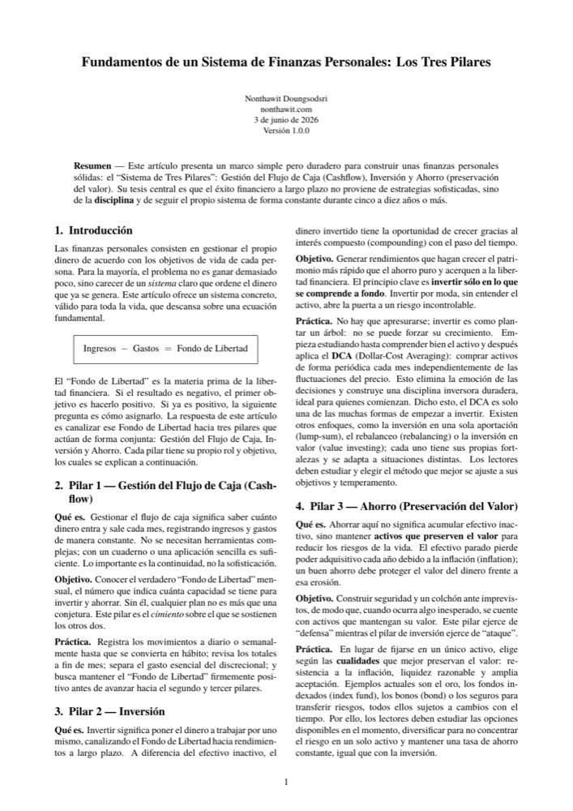
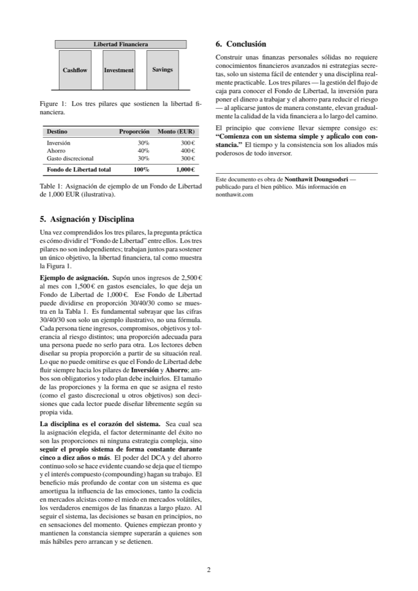

<div align="center">

🌐 **Idioma** &nbsp;|&nbsp;
[🇹🇭 ไทย](README-th.md) ·
[🇬🇧 English](../README.md) ·
**[🇪🇸 Español](README-es.md)** ·
[🇮🇩 Indonesia](README-id.md) ·
[🇨🇳 简体中文](README-zh.md) ·
[🇯🇵 日本語](README-ja.md)

<br>

# Fundamentos de un Sistema de Finanzas Personales: Los Tres Pilares

**Un white paper conciso que enseña cómo construir tus finanzas personales con un sencillo "Sistema de Tres Pilares" que funciona toda la vida**

[](../LICENSE)


</div>

---

## ⭐ Resumen en 10 segundos

Las finanzas sólidas no nacen de estrategias complejas, sino de **disciplina** + un sistema simple que puedas repetir durante años. Todo arranca de una sola ecuación:

<div align="center">

### Ingresos − Gastos = Fondo de Libertad

</div>

Luego distribuyes ese "Fondo de Libertad" en **3 pilares** que trabajan juntos:

| Pilar | Qué es | Función |
|---|---|---|
| 💵 **Gestión del Flujo de Caja** (Cashflow) | Saber cuánto entra y sale | Base: conocer tu "Fondo" real |
| 📈 **Inversión** (Investment) | Hacer que el dinero trabaje por ti | Ataque: construir rentabilidad compuesta |
| 🛡️ **Ahorro** (Preservación del valor) | Mantener activos que preserven valor | Defensa: combatir la inflación y reducir riesgos |

---

## 🎯 Por qué existe este documento

- Es el **principio de partida** para que diseñes tu propio sistema financiero
- Le da al lector un **mindset financiero válido para toda la vida** — no técnicas que quedan obsoletas
- Conciso, cabe en 2 páginas, se comprende en una sola lectura y se puede aplicar de inmediato

## 👤 Para quién es

- Personas que **empiezan desde cero** y quieren tener un sistema financiero de una vez
- Quienes no logran ahorrar y no saben a dónde se va el dinero
- Quienes quieren compartir ideas financieras sólidas con las personas que aman

---

## ✨ Qué cambia en tu IA al instalar esto

Con la skill instalada, tu IA deja de dar consejos financieros genéricos y razona a través del Sistema de Tres Pilares:

- Ancla cada respuesta en tus números reales — `Ingresos − Gastos = Fondo de Libertad` — antes de asesorar.
- Rechaza el hype: no recomendará un activo que no entiendes.
- Mantiene siempre tanto el ataque (**Investment**) como la defensa (**Savings**) en el plan.
- Prioriza la disciplina y un horizonte de 5–10 años sobre el timing inteligente.

**Tus prompts recibirán orientación financiera más precisa, consistente y menos genérica.**

---

## 🛠️ Cómo usarlo

### 🤖 AI Way — instala la skill

Este whitepaper se distribuye como una **skill de IA** — una lente de razonamiento. Dos estilos de instalación: **Auto** (un comando, para Claude Code y agentes CLI) o **Manual** (pega un archivo, para cualquier chatbot).

<details><summary><b>Claude Code — plugin (recommended)</b></summary>

Instalar:

```
/plugin marketplace add nontravis/personal-finance-whitepaper
/plugin install three-pillar-finance@nontravis
```

Actualizar a la última versión:

```
/plugin marketplace update nontravis
/reload-plugins
```

El plugin no tiene versión fija, por lo que cada push a este repositorio se ofrece como la versión más reciente.

</details>

<details><summary><b>Claude Code — degit (sin marketplace)</b></summary>

Instalar:

```
npx degit nontravis/personal-finance-whitepaper/skills/three-pillar-finance ~/.claude/skills/three-pillar-finance
```

Actualizar a la última versión — vuelve a ejecutar con `--force`:

```
npx degit nontravis/personal-finance-whitepaper/skills/three-pillar-finance ~/.claude/skills/three-pillar-finance --force
```

</details>

<details><summary><b>CLI agents (Gemini CLI, Copilot CLI)</b></summary>

Coloca la skill en el directorio adaptador del agente o en `AGENTS.md`:

```
npx degit nontravis/personal-finance-whitepaper/skills/three-pillar-finance ./.gemini/skills/three-pillar-finance
```

Actualizar: vuelve a ejecutar con `--force`.

</details>

<details><summary><b>claude.ai / ChatGPT / Gemini / API (pegado manual)</b></summary>

Copia [`three-pillar-lens.md`](../three-pillar-lens.md) y pégalo en las custom instructions del Project, ChatGPT Custom Instructions, un Gem, o el system prompt. Para actualizar, vuelve a copiar el archivo y reemplaza el bloque pegado.

</details>

> Marco educativo, no asesoramiento financiero personalizado. No menciona valores específicos.

### 📄 Physical Way — lee el whitepaper

Una lectura de 2 páginas. Imprímelo, ponlo donde lo veas cada día y compártelo con las personas que quieres.

| Idioma | Descarga |
|---|---|
| 🇹🇭 ไทย | [whitepaper-th.pdf](../whitepaper-th.pdf) |
| 🇬🇧 English | [whitepaper-en.pdf](../whitepaper-en.pdf) |
| 🇪🇸 Español | [whitepaper-es.pdf](../whitepaper-es.pdf) |
| 🇮🇩 Indonesia | [whitepaper-id.pdf](../whitepaper-id.pdf) |
| 🇨🇳 简体中文 | [whitepaper-zh.pdf](../whitepaper-zh.pdf) |
| 🇯🇵 日本語 | [whitepaper-ja.pdf](../whitepaper-ja.pdf) |

---

## 🖼️ Vista previa

<div align="center">

&nbsp;&nbsp;

</div>

---

## 💡 El único principio que vale recordar

> **"Comienza con un sistema simple y aplícalo con constancia."**
> El tiempo y la consistencia son los aliados más poderosos de todo inversor.

---

## ✍️ Autor

**Nonthawit Doungsodsri** — [nonthawit.com](https://nonthawit.com)
Publicado para el bien público.

---

## 📈 Star History

Si este documento te ha sido útil, deja una ⭐ como muestra de apoyo.

[](https://star-history.com/#nontravis/personal-finance-whitepaper&Date)

---

## 📜 Licencia

El contenido del white paper (texto, fuente LaTeX y PDFs) se publica bajo
**[la licencia MIT](../LICENSE)** — puedes usar, compartir, adaptar y distribuir, siempre que cites al autor.

Las fuentes incluidas en `latex/fonts/` son de terceros y tienen licencias independientes (SIL OFL, GUST, SIPA) —
consulta [`latex/fonts/LICENSES/NOTICE.md`](../latex/fonts/LICENSES/NOTICE.md)

Para instrucciones de compilación, consulta [`latex/README.md`](../latex/README.md).
