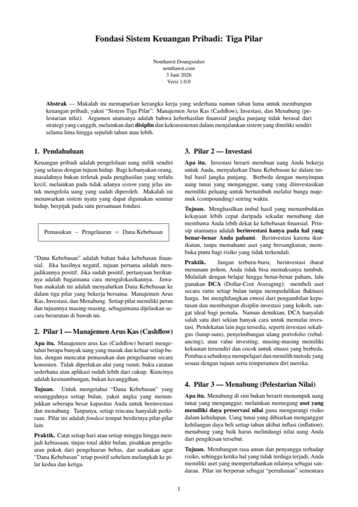
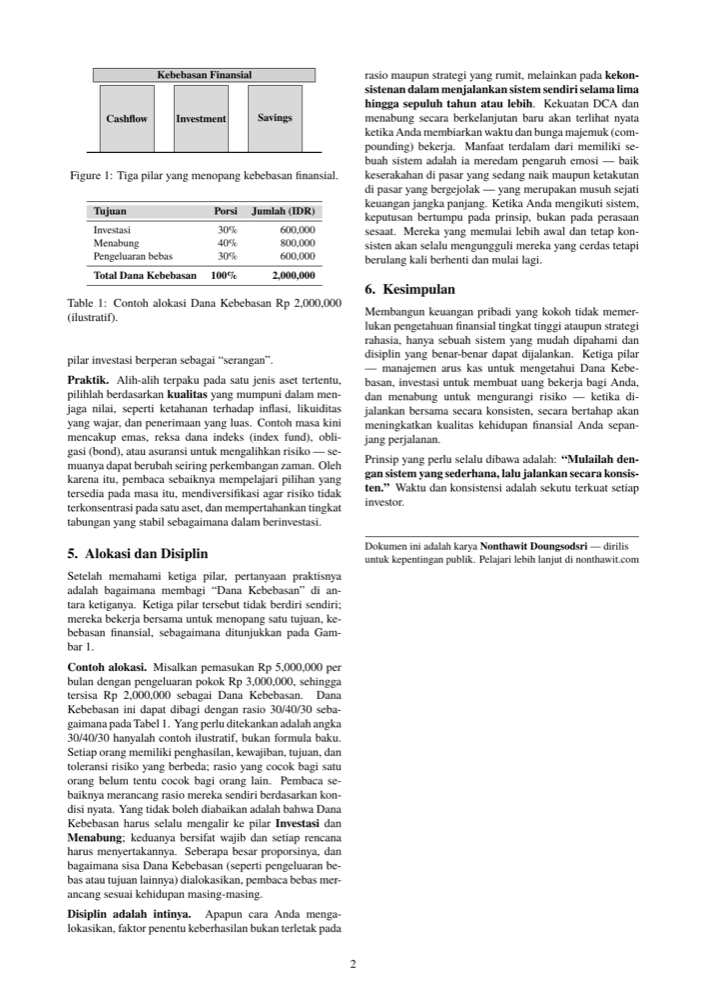

🌐 **Bahasa** &nbsp;|&nbsp;
[🇹🇭 ไทย](README-th.md) ·
[🇬🇧 English](../README.md) ·
[🇪🇸 Español](README-es.md) ·
**[🇮🇩 Indonesia](README-id.md)** ·
[🇨🇳 简体中文](README-zh.md) ·
[🇯🇵 日本語](README-ja.md)

 

# Fondasi Sistem Keuangan Pribadi: Tiga Pilar

**Whitepaper ringkas yang mengajarkan cara membangun keuangan pribadi dengan "Sistem Tiga Pilar" yang sederhana dan bisa dipakai seumur hidup**

---

## ⭐ Ringkasan 10 Detik

Keuangan yang kokoh bukan lahir dari strategi yang rumit, melainkan dari **disiplin** + sistem yang sederhana dan bisa dijalankan berulang kali dalam jangka panjang. Semuanya bermula dari satu persamaan:

### Pemasukan − Pengeluaran = Dana Kebebasan

Kemudian salurkan "Dana Kebebasan" ke dalam **3 pilar** yang bekerja bersama-sama:

| Pilar | Artinya | Perannya |
|---|---|---|
| 💵 **Manajemen Arus Kas** (Cashflow) | Tahu berapa uang yang masuk dan keluar | Fondasi — mengetahui "Dana Kebebasan" yang sesungguhnya |
| 📈 **Investasi** (Investment) | Membuat uang bekerja untuk kita | Menyerang — membangun imbal hasil melalui bunga majemuk |
| 🛡️ **Menabung** (Savings) | Memegang aset yang mempertahankan nilai | Bertahan — melawan inflasi dan meredam risiko |

---

## 🎯 Mengapa Dokumen Ini Ada

- Menjadi **prinsip awal** agar kamu bisa merancang keuanganmu sendiri
- Memberi pembaca **mindset keuangan yang berlaku seumur hidup** — bukan teknik yang usang dimakan zaman
- Ringkas, selesai dalam 2 halaman, sekali baca langsung paham, langsung bisa diterapkan

## 👤 Cocok untuk Siapa

- Orang yang **memulai dari nol** dan ingin punya sistem keuangan yang nyata
- Orang yang tidak bisa menyimpan uang dan bingung uangnya pergi ke mana
- Orang yang ingin berbagi cara berpikir keuangan yang baik kepada orang-orang terdekat

---

## 📖 Baca Sekarang

Pilih bahasamu — setiap file adalah PDF siap cetak:

| Bahasa | Unduh |
|---|---|
| 🇹🇭 ไทย | [whitepaper-th.pdf](../whitepaper-th.pdf) |
| 🇬🇧 English | [whitepaper-en.pdf](../whitepaper-en.pdf) |
| 🇪🇸 Español | [whitepaper-es.pdf](../whitepaper-es.pdf) |
| 🇮🇩 Indonesia | [whitepaper-id.pdf](../whitepaper-id.pdf) |
| 🇨🇳 简体中文 | [whitepaper-zh.pdf](../whitepaper-zh.pdf) |
| 🇯🇵 日本語 | [whitepaper-ja.pdf](../whitepaper-ja.pdf) |

---

## 🖼️ Tampilan Halaman

&nbsp;&nbsp;

---

## 🚀 Cara Menggunakannya

**1. Cetak dan tempel di tempat yang sering kamu lihat** 🖨️
Unduh PDF → cetak → tempel di samping meja kerja, depan cermin, atau pintu kulkas.
Keuangan berubah lewat "melihat berulang kali" hingga menjadi kebiasaan.

**2. Bagikan cara berpikir ini kepada orang yang kamu sayangi** ❤️
Kirimkan tautan ini kepada keluarga, teman, atau siapa pun yang baru memulai.
Salah satu hadiah terbaik adalah "sistem berpikir" yang menemaninya seumur hidup.

---

## 💡 Satu Prinsip yang Perlu Selalu Dibawa

> **"Mulailah dengan sistem yang sederhana, lalu jalankan secara konsisten."**
> Waktu dan konsistensi adalah sekutu terkuat setiap investor.

---

## ✍️ Penulis

**Nonthawit Doungsodsri** — [nonthawit.com](https://nonthawit.com)
Dirilis untuk kepentingan publik.

---

## 📈 Star History

Jika dokumen ini bermanfaat, mohon berikan ⭐ sebagai dukungan ya!

---

## 📜 Lisensi

Konten whitepaper (teks, sumber LaTeX, dan PDF) dirilis di bawah
**[Creative Commons Attribution 4.0 (CC BY 4.0)](../LICENSE)** — bebas dibagikan, dimodifikasi, dan digunakan secara komersial, asalkan mencantumkan kredit kepada penulis.

Font yang disertakan di `latex/fonts/` adalah milik pihak ketiga dengan lisensi terpisah (SIL OFL, GUST, SIPA) —
lihat [`latex/fonts/LICENSES/NOTICE.md`](../latex/fonts/LICENSES/NOTICE.md).

Untuk informasi build, lihat [`latex/README.md`](../latex/README.md).
