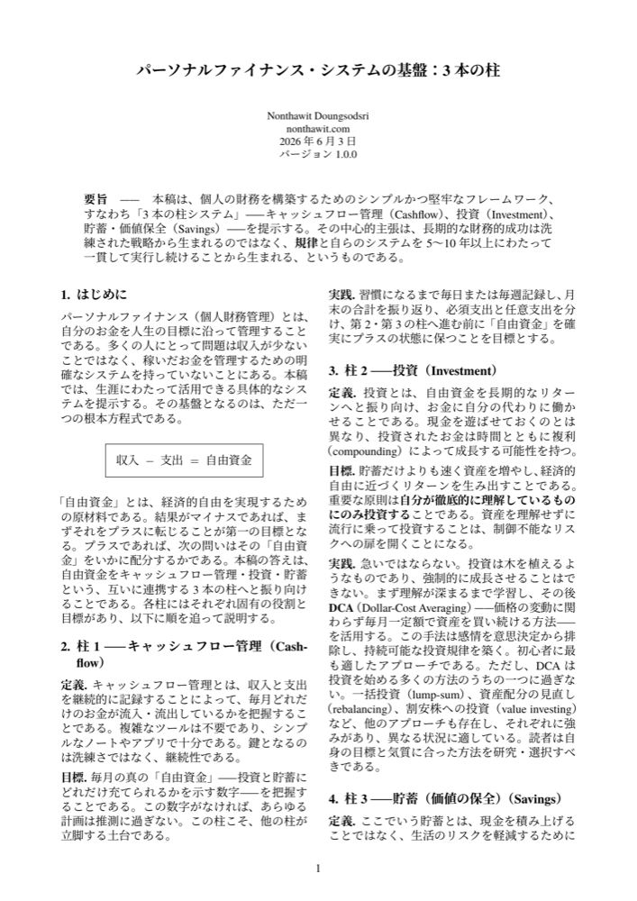
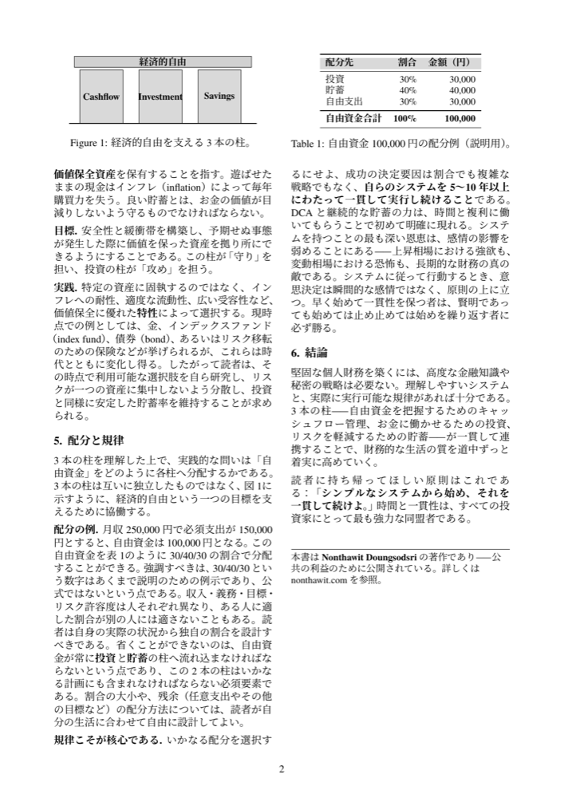

🌐 **言語** &nbsp;|&nbsp;
[🇹🇭 ไทย](README-th.md) ·
[🇬🇧 English](../README.md) ·
[🇪🇸 Español](README-es.md) ·
[🇮🇩 Indonesia](README-id.md) ·
[🇨🇳 简体中文](README-zh.md) ·
**[🇯🇵 日本語](README-ja.md)**

 

# パーソナルファイナンス・システムの基盤：3本の柱

**シンプルで一生使える「3本の柱システム」で、自分だけの個人財務を設計するための短いホワイトペーパー**

---

## ⭐ 10秒でわかる要点

盤石な財務は複雑な戦略から生まれるのではなく、**規律** と、長く続けられるシンプルなシステムから生まれます。すべては、たったひとつの方程式から始まります：

### 収入 − 支出 = 自由資金

そして、その「自由資金」を互いに連携する **3本の柱** へと振り向けます：

| 柱 | 何か | 役割 |
|---|---|---|
| 💵 **キャッシュフロー管理**（Cashflow） | お金の流れを把握する | 土台。真の「自由資金」を知る |
| 📈 **投資**（Investment） | お金に働かせる | 攻め。複利で資産を増やす |
| 🛡️ **貯蓄・価値保全**（Savings） | 価値保全資産を保有する | 守り。インフレに対抗しリスクを軽減する |

---

## 🎯 このドキュメントについて

- 自分だけの財務設計を始めるための **基本原則** を提供します
- 時代に左右されない **一生使えるマネーマインドセット** を手に入れられます — 流行のテクニックではありません
- 2ページにぎゅっとまとめた、読めばすぐに実践できる内容です

## 👤 こんな方に

- **ゼロから始める**人、まともな財務システムをそろそろ持ちたい人
- お金を貯められない、どこに消えるかわからないと感じている人
- 大切な人に良い財務の考え方を伝えたい人

---

## 🤖 AI でこのフレームワークを使う

本ホワイトペーパーは **AI skill** としても提供されています。三支柱システム（`収入 − 支出 = 自由基金`、Cashflow / Investment / Savings に配分し、戦略よりも規律を重視）を通じて、あらゆる高性能 AI が助言できるようにする推論レンズです。ソースは一つ、バージョンは二つ：ファイルを読み込めるエージェント向けの [`skill/`](../skill/) フォルダーと、任意のチャットボットに貼り付けられる単一ファイル [`three-pillar-lens.md`](../three-pillar-lens.md) です。

| プラットフォーム | 読み込み方法 | 動作 |
|---|---|---|
| Claude Code | `skill/` フォルダーをコピー | お金の話題で自動的に適用 |
| claude.ai (Project) | `three-pillar-lens.md` を貼り付け | その Project で常時有効 |
| ChatGPT | `three-pillar-lens.md` を貼り付け | そのコンテキストで常時有効 |
| Gemini | `three-pillar-lens.md` を貼り付け | その Gem で常時有効 |
| Any API / CLI agent | system prompt の先頭に追加 | 常時有効 |

<b>Claude Code</b>

1. このリポジトリをダウンロードまたはクローンします。
2. `skill/` フォルダーをプロジェクトの `.claude/skills/three-pillar-finance/`、またはすべてのプロジェクトで使う場合は `~/.claude/skills/three-pillar-finance/` にコピーします。
3. セッションを開始します。予算、貯蓄、投資について話すと、レンズが自動的に適用されます。

<b>claude.ai (Project)</b>

1. [`three-pillar-lens.md`](../three-pillar-lens.md) を開き、ファイル全体をコピーします。
2. claude.ai で Project を作成または開きます。
3. Project の custom instructions に貼り付けます。その Project のすべてのチャットでレンズが使われます。

<b>ChatGPT</b>

1. [`three-pillar-lens.md`](../three-pillar-lens.md) を開き、ファイル全体をコピーします。
2. 設定 ▸ パーソナライズ ▸ Custom Instructions、または Project の指示、もしくはカスタム GPT のナレッジに貼り付けます。

<b>Gemini</b>

1. [`three-pillar-lens.md`](../three-pillar-lens.md) を開き、ファイル全体をコピーします。
2. Gem の指示、または Saved Info に貼り付けます。

<b>Any API / CLI agent</b>

1. [`three-pillar-lens.md`](../three-pillar-lens.md) を system prompt の先頭に追加します。
2. ファイルツール対応の CLI エージェント（Gemini CLI、Copilot CLI）の場合は、エージェントのアダプターディレクトリまたは `AGENTS.md` に配置します。

> 教育目的のフレームワークであり、個別の金融アドバイスではありません。特定の有価証券には言及していません。

---

## 📖 読む

お好みの言語を選んでください — どのファイルも印刷対応PDFです：

| 言語 | ダウンロード |
|---|---|
| 🇹🇭 ไทย | [whitepaper-th.pdf](../whitepaper-th.pdf) |
| 🇬🇧 English | [whitepaper-en.pdf](../whitepaper-en.pdf) |
| 🇪🇸 Español | [whitepaper-es.pdf](../whitepaper-es.pdf) |
| 🇮🇩 Indonesia | [whitepaper-id.pdf](../whitepaper-id.pdf) |
| 🇨🇳 简体中文 | [whitepaper-zh.pdf](../whitepaper-zh.pdf) |
| 🇯🇵 日本語 | [whitepaper-ja.pdf](../whitepaper-ja.pdf) |

---

## 🖼️ プレビュー

&nbsp;&nbsp;

---

## 🚀 活用方法

**1. 印刷して毎日目に入る場所に貼る** 🖨️
PDFをダウンロード → 印刷 → デスクの横、鏡の前、冷蔵庫などに貼り付けましょう。
財務は「繰り返し目にすること」で、習慣として身についていきます。

**2. 大切な人とシェアする** ❤️
このリンクを家族や友人、財務を一から始めたい人に送りましょう。
最高のプレゼントのひとつは、その人の人生に根付く「思考のシステム」です。

---

## 💡 ひとつだけ覚えてほしい原則

> **「シンプルなシステムから始め、それを一貫して続けよ。」**
> 時間と一貫性は、すべての投資家にとって最も強力な同盟者である。

---

## ✍️ 著者

**Nonthawit Doungsodsri** — [nonthawit.com](https://nonthawit.com)
公共の利益のために公開

---

## 📈 Star History

このドキュメントが役に立ったら、⭐ をつけていただけると励みになります！

---

## 📜 ライセンス

ホワイトペーパーの本文、LaTeXソース、PDFは **[Creative Commons Attribution 4.0 (CC BY 4.0)](../LICENSE)** のもとで公開されています — 著者をクレジットすれば、シェア・改変・商用利用が可能です。

`latex/fonts/` に同梱されているフォントは第三者のものであり、個別のライセンス（SIL OFL、GUST、SIPA）が適用されます —
[`latex/fonts/LICENSES/NOTICE.md`](../latex/fonts/LICENSES/NOTICE.md) をご覧ください。

PDFのビルド方法については [`latex/README.md`](../latex/README.md) をご参照ください。
