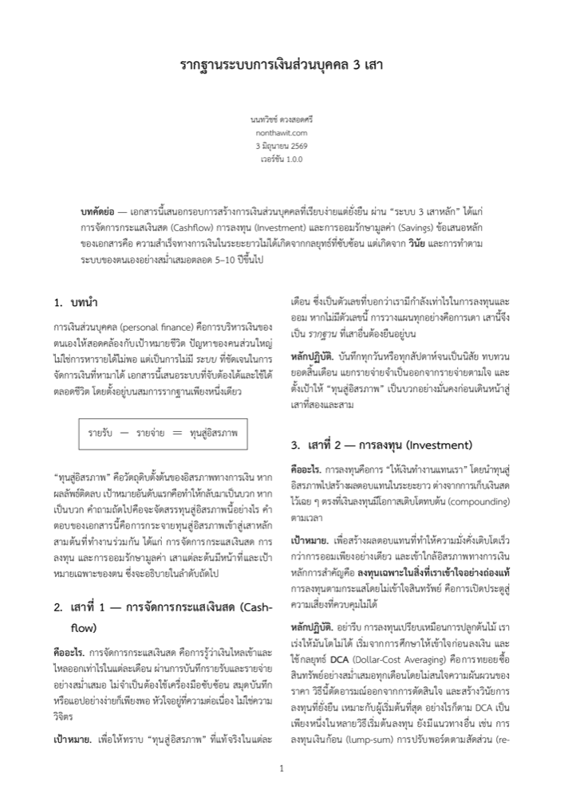
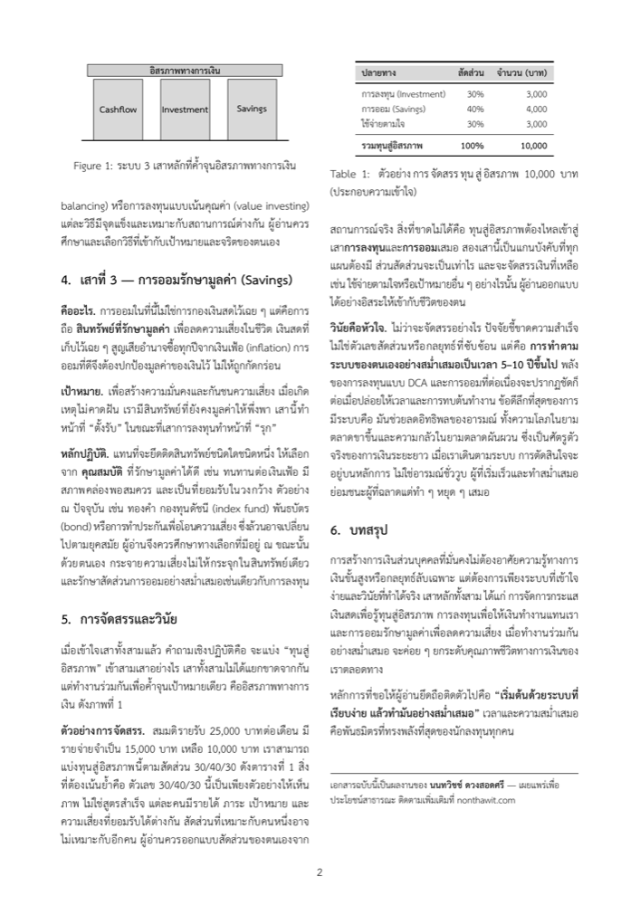

<div align="center">

🌐 **ภาษา** &nbsp;|&nbsp;
**[🇹🇭 ไทย](README-th.md)** ·
[🇬🇧 English](../README.md) ·
[🇪🇸 Español](README-es.md) ·
[🇮🇩 Indonesia](README-id.md) ·
[🇨🇳 简体中文](README-zh.md) ·
[🇯🇵 日本語](README-ja.md)

<br>

# รากฐานระบบการเงินส่วนบุคคล 3 เสา

**ไวต์เปเปอร์สั้น ๆ ที่สอนวิธีสร้างการเงินส่วนบุคคลด้วย “ระบบ 3 เสา” ที่เรียบง่าย ใช้ได้ทั้งชีวิต**

[](../LICENSE)


</div>

---

## ⭐ สรุปใน 10 วินาที

การเงินที่มั่นคงไม่ได้เกิดจากกลยุทธ์ซับซ้อน แต่เกิดจาก **วินัย** + ระบบที่เรียบง่าย ทำซ้ำได้นาน ๆ ทุกอย่างเริ่มจากสมการเดียว:

<div align="center">

### รายรับ − รายจ่าย = ทุนสู่อิสรภาพ

</div>

แล้วกระจาย “ทุนสู่อิสรภาพ” เข้า **3 เสา** ที่ทำงานร่วมกัน:

| เสา | คือ | ทำหน้าที่ |
|---|---|---|
| 💵 **กระแสเงินสด** (Cashflow) | รู้ว่าเงินเข้า-ออกเท่าไร | รากฐาน รู้ “ทุน” ที่แท้จริง |
| 📈 **การลงทุน** (Investment) | ให้เงินทำงานแทนเรา | รุก สร้างผลตอบแทนทบต้น |
| 🛡️ **การออมรักษามูลค่า** (Savings) | ถือสินทรัพย์ที่รักษามูลค่า | ตั้งรับ สู้เงินเฟ้อ ลดความเสี่ยง |

---

## 🎯 ทำไมถึงมีเอกสารนี้

- เป็น **หลักการตั้งต้น** ให้คุณออกแบบการเงินของตัวเองได้
- ให้ผู้อ่านมี **mindset การเงินที่ใช้ได้ตลอดชีวิต** — ไม่ใช่เทคนิคที่ล้าสมัยตามยุค
- กระชับ จบใน 2 หน้า อ่านรอบเดียวเข้าใจ เอาไปใช้ได้จริง

## 👤 เหมาะกับใคร

- คนที่ **เริ่มต้นจากศูนย์** อยากมีระบบการเงินสักที
- คนที่เก็บเงินไม่อยู่ ไม่รู้เงินหายไปไหน
- คนที่อยากส่งต่อแนวคิดการเงินดี ๆ ให้คนรอบตัว

---

## ✨ ติดตั้งแล้ว AI ของคุณจะเปลี่ยนไปอย่างไร

เมื่อติดตั้ง skill แล้ว AI จะหยุดให้คำแนะนำทางการเงินแบบทั่วไป และเริ่มใช้เหตุผลผ่านระบบ 3 เสา:

- ยึดทุกคำตอบบนตัวเลขจริงของคุณ — `รายรับ − รายจ่าย = ทุนสู่อิสรภาพ` — ก่อนให้คำแนะนำเสมอ
- ปฏิเสธกระแสฮือฮา: จะไม่แนะนำสินทรัพย์ที่คุณไม่เข้าใจ
- รักษาสมดุลทั้งฝ่ายรุก (**Investment**) และฝ่ายรับ (**Savings**) ไว้ในแผนเสมอ
- เน้นวินัยและขอบฟ้า 5–10 ปี มากกว่าการจับจังหวะตลาดให้แม่นยำ

**พรอมต์ของคุณจะได้รับคำแนะนำทางการเงินที่คมชัด สม่ำเสมอ และไม่ซ้ำแบบใครมากขึ้น**

---

## 🛠️ วิธีใช้งาน

### 🤖 AI Way — ติดตั้ง skill

ไวต์เปเปอร์นี้มาพร้อมกับ **AI skill** — เลนส์ความคิดสำหรับการให้เหตุผล รองรับสองสไตล์การติดตั้ง: **Auto** (คำสั่งเดียว สำหรับ Claude Code และ CLI agent) หรือ **Manual** (วางไฟล์เดียว สำหรับ chatbot ทุกชนิด)

<details><summary><b>Claude Code — plugin (recommended)</b></summary>

ติดตั้ง:

```
/plugin marketplace add nontravis/personal-finance-whitepaper
/plugin install three-pillar-finance@nontravis
```

อัปเดตเป็นเวอร์ชันล่าสุด:

```
/plugin marketplace update nontravis
/reload-plugins
```

plugin นี้ไม่ได้ระบุเวอร์ชัน ดังนั้นทุก push ไปยัง repo นี้จะถูกเสนอเป็นเวอร์ชันล่าสุดเสมอ

</details>

<details><summary><b>Claude Code — degit (ไม่ใช้ marketplace)</b></summary>

ติดตั้ง:

```
npx degit nontravis/personal-finance-whitepaper/skill ~/.claude/skills/three-pillar-finance
```

อัปเดตเป็นเวอร์ชันล่าสุด — รันซ้ำพร้อม `--force`:

```
npx degit nontravis/personal-finance-whitepaper/skill ~/.claude/skills/three-pillar-finance --force
```

</details>

<details><summary><b>CLI agents (Gemini CLI, Copilot CLI)</b></summary>

วาง skill ลงใน adapter directory ของ agent หรือใน `AGENTS.md`:

```
npx degit nontravis/personal-finance-whitepaper/skill ./.gemini/skills/three-pillar-finance
```

อัปเดต: รันซ้ำพร้อม `--force`

</details>

<details><summary><b>claude.ai / ChatGPT / Gemini / API (วางด้วยตนเอง)</b></summary>

คัดลอก [`three-pillar-lens.md`](../three-pillar-lens.md) แล้ววางลงใน custom instructions ของ Project, ChatGPT Custom Instructions, Gem, หรือ system prompt หากต้องการอัปเดต ให้คัดลอกไฟล์ใหม่แล้วแทนที่บล็อกเดิม

</details>

> เฟรมเวิร์กเพื่อการศึกษา ไม่ใช่คำแนะนำทางการเงินส่วนบุคคล ไม่มีการระบุหลักทรัพย์เฉพาะเจาะจง

### 📄 Physical Way — อ่านไวต์เปเปอร์

อ่านจบใน 2 หน้า ปริ้นต์ แปะไว้ที่ที่คุณอ่านทุกวัน และแชร์ให้คนที่คุณรัก

| ภาษา | ดาวน์โหลด |
|---|---|
| 🇹🇭 ไทย | [whitepaper-th.pdf](../whitepaper-th.pdf) |
| 🇬🇧 English | [whitepaper-en.pdf](../whitepaper-en.pdf) |
| 🇪🇸 Español | [whitepaper-es.pdf](../whitepaper-es.pdf) |
| 🇮🇩 Indonesia | [whitepaper-id.pdf](../whitepaper-id.pdf) |
| 🇨🇳 简体中文 | [whitepaper-zh.pdf](../whitepaper-zh.pdf) |
| 🇯🇵 日本語 | [whitepaper-ja.pdf](../whitepaper-ja.pdf) |

---

## 🖼️ ตัวอย่างหน้าตา

<div align="center">

&nbsp;&nbsp;

</div>

---

## 💡 หลักการเดียวที่ขอให้จำ

> **“เริ่มต้นด้วยระบบที่เรียบง่าย แล้วทำมันอย่างสม่ำเสมอ”**
> เวลาและความสม่ำเสมอ คือพันธมิตรที่ทรงพลังที่สุดของนักลงทุนทุกคน

---

## ✍️ ผู้เขียน

**นนทวิชช์ ดวงสอดศรี** — [nonthawit.com](https://nonthawit.com)
เผยแพร่เพื่อประโยชน์สาธารณะ

---

## 📈 Star History

ถ้าเอกสารนี้มีประโยชน์ ฝากกด ⭐ เป็นกำลังใจด้วยนะครับ

[](https://star-history.com/#nontravis/personal-finance-whitepaper&Date)

---

## 📜 ลิขสิทธิ์

เนื้อหาไวต์เปเปอร์ (ข้อความ ซอร์ส LaTeX และ PDF) เผยแพร่ภายใต้
**[MIT License](../LICENSE)** — ใช้ แชร์ ดัดแปลง และเผยแพร่ได้ โดยให้เครดิตผู้เขียน

ฟอนต์ที่แนบมาใน `latex/fonts/` เป็นของบุคคลที่สาม มีสัญญาอนุญาตแยกต่างหาก (SIL OFL, GUST, SIPA) —
ดู [`latex/fonts/LICENSES/NOTICE.md`](../latex/fonts/LICENSES/NOTICE.md)
