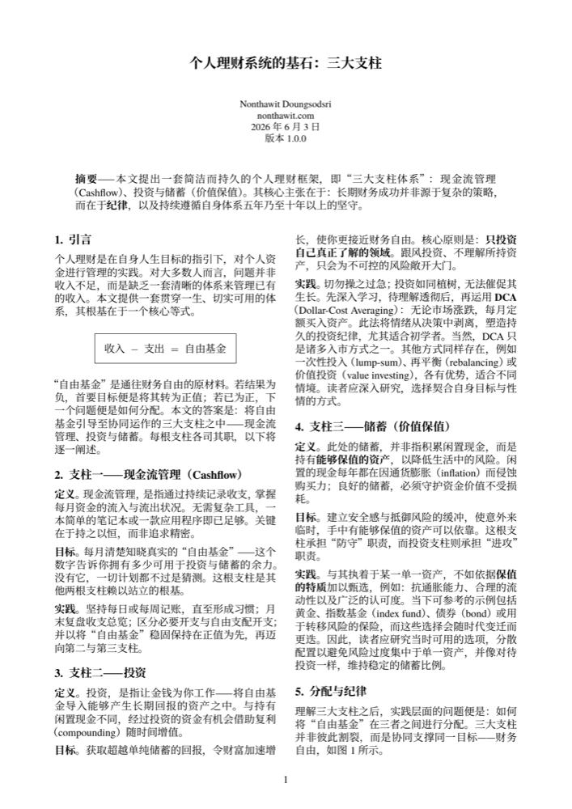
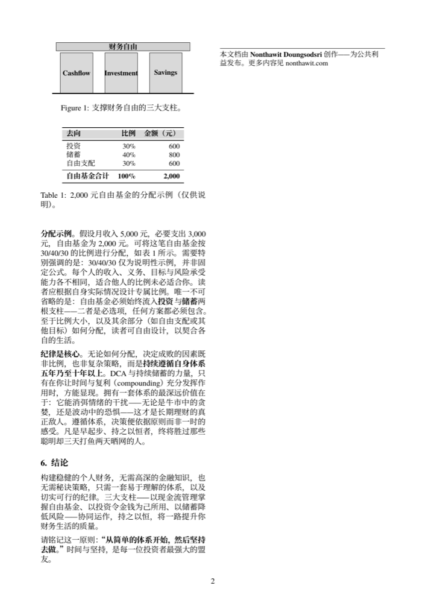

<div align="center">

🌐 **语言** &nbsp;|&nbsp;
[🇹🇭 ไทย](README-th.md) ·
[🇬🇧 English](../README.md) ·
[🇪🇸 Español](README-es.md) ·
[🇮🇩 Indonesia](README-id.md) ·
**[🇨🇳 简体中文](README-zh.md)** ·
[🇯🇵 日本語](README-ja.md)

<br>

# 个人理财系统的基石：三大支柱

**一本简洁的白皮书，教你用"三大支柱体系"构建一生受用的个人理财基础**

[](../LICENSE)


</div>

---

## ⭐ 10秒概览

稳健的财务并非来自复杂的策略，而来自**纪律** + 一套简单、可持续执行的体系。一切从这一个等式出发：

<div align="center">

### 收入 − 支出 = 自由基金

</div>

再将"自由基金"分配至协同运作的**三大支柱**：

| 支柱 | 是什么 | 作用 |
|---|---|---|
| 💵 **现金流管理**（Cashflow） | 掌握资金的进出状况 | 根基——知道真实的"自由基金" |
| 📈 **投资**（Investment） | 让金钱为你工作 | 进攻——借助复利积累长期回报 |
| 🛡️ **储蓄（价值保值）**（Savings） | 持有能够保值的资产 | 防守——对抗通胀、降低风险 |

---

## 🎯 为什么写这份文档

- 提供一套**理财基本原则**，让你能够设计专属于自己的财务体系
- 帮助读者建立**终身受用的理财思维**——而非随时代变迁而过时的技巧
- 精炼简洁，全文仅2页，读一遍即可理解，读完即可付诸实践

## 👤 适合哪些人

- **从零出发**、想要建立理财体系的人
- 存不住钱、不知道钱去哪了的人
- 想把好的理财观念传递给身边人的人

---

## 🤖 在你的 AI 中使用此框架

本白皮书同样以 **AI skill** 的形式发布——一个推理镜头，让任何有能力的 AI 都能通过三支柱体系（`收入 − 支出 = 自由基金`，分配至 Cashflow / Investment / Savings，以纪律优先于策略）提供建议。同一来源，两种安装方式：**Auto**（一条命令，适用于 Claude Code 和 CLI agent）或 **Manual**（粘贴一个文件，适用于任何聊天机器人）。

### ⚡ Auto install（一条命令）

<details><summary><b>Claude Code — plugin（recommended）</b></summary>

安装：

```
/plugin marketplace add nontravis/personal-finance-whitepaper
/plugin install three-pillar-finance@nontravis
```

更新至最新版本：

```
/plugin marketplace update nontravis
/reload-plugins
```

该 plugin 不锁定版本，因此每次推送到本仓库都会作为最新版本提供。

</details>

<details><summary><b>Claude Code — degit（不使用 marketplace）</b></summary>

安装：

```
npx degit nontravis/personal-finance-whitepaper/skill ~/.claude/skills/three-pillar-finance
```

更新至最新版本——加上 `--force` 重新运行：

```
npx degit nontravis/personal-finance-whitepaper/skill ~/.claude/skills/three-pillar-finance --force
```

</details>

<details><summary><b>CLI agents（Gemini CLI、Copilot CLI）</b></summary>

将 skill 放入 agent 的 adapter 目录或 `AGENTS.md`：

```
npx degit nontravis/personal-finance-whitepaper/skill ./.gemini/skills/three-pillar-finance
```

更新：加上 `--force` 重新运行。

</details>

### ✋ Manual install（复制粘贴）

对于无法读取文件的聊天机器人，将单个平铺文件
[`three-pillar-lens.md`](../three-pillar-lens.md) 直接粘贴进去。如需日后更新，重新复制并替换已粘贴的内容即可。

<details><summary><b>claude.ai（Project）</b></summary>

1. 打开 [`three-pillar-lens.md`](../three-pillar-lens.md) 并复制整个文件。
2. 创建或打开一个 Project，将其粘贴到 Project 的 custom instructions 中。

</details>

<details><summary><b>ChatGPT</b></summary>

1. 打开 [`three-pillar-lens.md`](../three-pillar-lens.md) 并复制整个文件。
2. 将其粘贴到「设置 ▸ 个性化 ▸ Custom Instructions」、Project 的说明，或自定义 GPT 的知识库中。

</details>

<details><summary><b>Gemini</b></summary>

1. 打开 [`three-pillar-lens.md`](../three-pillar-lens.md) 并复制整个文件。
2. 将其粘贴到 Gem 的说明中，或粘贴到 Saved Info 中。

</details>

<details><summary><b>Any API / app</b></summary>

将 [`three-pillar-lens.md`](../three-pillar-lens.md) 置于 system prompt 的开头。

</details>

> 教育性框架，非个人化财务建议，不涉及任何具体证券。

---

## 📖 立即阅读

选择你的语言——每个文件均为可打印的 PDF：

| 语言 | 下载 |
|---|---|
| 🇹🇭 ไทย | [whitepaper-th.pdf](../whitepaper-th.pdf) |
| 🇬🇧 English | [whitepaper-en.pdf](../whitepaper-en.pdf) |
| 🇪🇸 Español | [whitepaper-es.pdf](../whitepaper-es.pdf) |
| 🇮🇩 Indonesia | [whitepaper-id.pdf](../whitepaper-id.pdf) |
| 🇨🇳 简体中文 | [whitepaper-zh.pdf](../whitepaper-zh.pdf) |
| 🇯🇵 日本語 | [whitepaper-ja.pdf](../whitepaper-ja.pdf) |

---

## 🖼️ 内容预览

<div align="center">

&nbsp;&nbsp;

</div>

---

## 🚀 如何使用

**1. 打印出来，放在每天都能看到的地方** 🖨️
下载 PDF → 打印 → 贴在书桌旁、镜子前或冰箱上
理财的改变来自"反复看见"，直到它成为一种习惯

**2. 把这份好思维分享给你在乎的人** ❤️
把链接发给家人、朋友，或者正在起步的人
最好的礼物之一，是一套能陪伴他们一生的"思维体系"

---

## 💡 唯一需要记住的原则

> **"从简单的体系开始，然后坚持去做。"**
> 时间与坚持，是每一位投资者最强大的盟友。

---

## ✍️ 作者

**Nonthawit Doungsodsri** — [nonthawit.com](https://nonthawit.com)
公开发布，供公众受益

---

## 📈 Star 历史

如果这份文档对你有帮助，欢迎点 ⭐ 鼓励一下！

[](https://star-history.com/#nontravis/personal-finance-whitepaper&Date)

---

## 📜 版权声明

白皮书内容（文本、LaTeX 源码与 PDF）以
**[Creative Commons Attribution 4.0（CC BY 4.0）](../LICENSE)** 协议发布——可分享、改编、商业使用，仅需注明作者。

`latex/fonts/` 目录下附带的字体为第三方资源，各有独立许可协议（SIL OFL、GUST、SIPA）——
详见 [`latex/fonts/LICENSES/NOTICE.md`](../latex/fonts/LICENSES/NOTICE.md)

如需从源码构建，请参阅 [`latex/README.md`](../latex/README.md)
